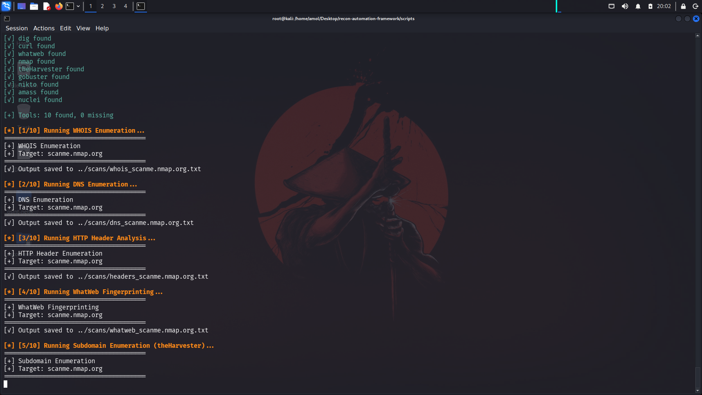
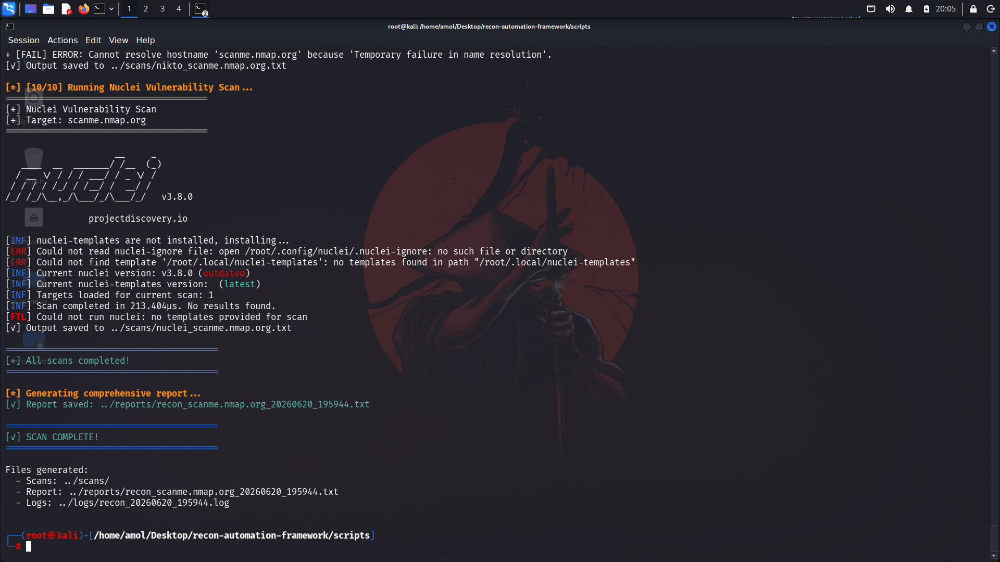

# 🔥 Recon Automation Framework v2.0

<p align="center">


</p>

Automated reconnaissance framework built with Bash and Kali Linux tools for OSINT, DNS enumeration, web fingerprinting, subdomain discovery, service enumeration, vulnerability scanning, and report generation.

---

## ⚠ Disclaimer

This framework is intended for educational purposes and authorized security assessments only.

Never scan systems without proper authorization.

---

# 🎯 Features

* ✅ WHOIS Enumeration
* ✅ DNS Enumeration
* ✅ HTTP Header Analysis
* ✅ Web Fingerprinting (WhatWeb)
* ✅ Subdomain Enumeration (theHarvester + AMASS)
* ✅ Service Enumeration (Nmap)
* ✅ Directory Enumeration (Gobuster)
* ✅ Web Vulnerability Scanning (Nikto)
* ✅ Template-Based Vulnerability Detection (Nuclei)
* ✅ Tool Detection
* ✅ Logging
* ✅ Automated Report Generation
* ✅ HTML Report Generation

---

# 🛠 Technologies

* Bash
* Kali Linux
* Nmap
* WhatWeb
* theHarvester
* AMASS
* Gobuster
* Nikto
* Nuclei
* Python

---

# 🚀 Installation

```bash
git clone https://github.com/Amol1307/recon-automation-framework.git

cd recon-automation-framework

chmod +x scripts/*.sh
```

---

# 📋 Requirements

```bash
apt update

apt install -y whois dnsutils curl nmap whatweb theharvester gobuster nikto amass nuclei
```

---

# 💻 Usage

Run the master script:

```bash
./scripts/recon.sh example.com
```

The framework performs:

1. WHOIS Enumeration
2. DNS Enumeration
3. HTTP Header Analysis
4. Web Fingerprinting
5. Subdomain Enumeration (theHarvester)
6. Subdomain Enumeration (AMASS)
7. Service Enumeration (Nmap)
8. Directory Enumeration (Gobuster)
9. Vulnerability Scanning (Nikto)
10. Vulnerability Scanning (Nuclei)
11. Logging
12. Report Generation

---

# 📄 Generate HTML Report

```bash
python3 scripts/generate_html_report.py example.com
```

---

# 📁 Project Structure

```text
recon-automation-framework
├── logs
├── reports
├── scans
├── screenshots
├── scripts
├── findings
├── targets
└── README.md
```

---

# 📸 Screenshots

### Framework Execution



### Final Scan Output



---

# 📊 Sample Output

Generated files:

```text
reports/
├── report.txt
├── report.html

scans/
├── whois.txt
├── dns.txt
├── headers.txt
├── whatweb.txt
├── subdomains.txt
├── amass.txt
├── nmap.txt
├── gobuster.txt
├── nikto.txt
└── nuclei.txt
```

---

# 🚀 Future Improvements

* Multi-target support
* Parallel execution
* JSON reports
* Colored output
* Configuration files
* Assetfinder integration
* Subfinder integration
* DNSRecon integration
* FFUF support
* HTML dashboard

---

# 📜 License

MIT License

---

## 👨‍💻 Author

**Amol Nimade**

GitHub: https://github.com/Amol1307

LinkedIn: https://www.linkedin.com/in/amol-nimade-0b3436289

---

⭐ If you found this project useful, consider giving it a star.
